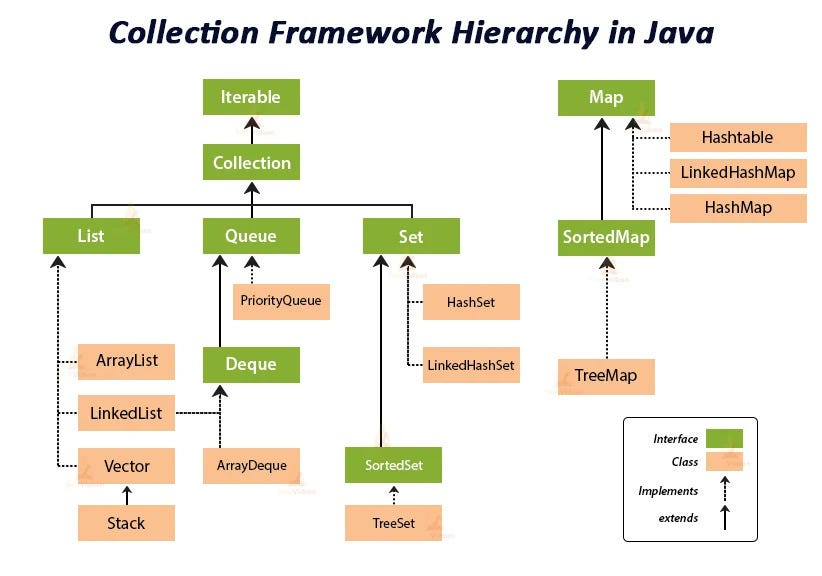

- List is interface
```java
interface List<E>
```
E :- type of element

- An ordered collection (also known as a sequence). 
- The user of this interface has precise control over where in the list each element is inserted. The user can access elements by their integer index (position in the list), and search for elements in the list.
- Allows duplicate elements and null values (depending on the implementation).


#### ArrayList
- Implements List<E> using a dynamic, resizable array.
- so same advantage and disadvantages as arrays
- since 1.2
- Default initial capacity is 10; grows dynamically (e.g., by ~50% when full)
- Not thread-safe (use Collections.synchronizedList for synchronization).
- Fast random access (O(1)), but slow for insertions/deletions in the middle (O(n)).
- abstract data type
  - An abstract data type defines operations without specifying the underlying implementation
  - concrete data structure is usually a concrete class
  - abstract data type is usually an interface
- Extends AbstractList and implements List<E>, RandomAccess, Cloneable, and Serializable.
- **When to use?** When you need fast random access and infrequent insertions/removals.


### vector
- thread safe arraylist
- comes before arraylist
- since 1.0
- Higher performance overhead compared to ArrayList due to synchronization.
- uses array
- **When to use?** Only when working in a multi-threaded environment where synchronization is required.


### linked List
- class
- Nodes
- first is head
- extend abstractsequentiallist
- Extends AbstractSequentialList and implements List<E>, Deque<E>, Cloneable, and Serializable
- Implemented as a doubly linked list.
- implementation is not synchronized
- Efficient for insertions/deletions (O(1) if position known), but slow for random access (O(n)).
- **When to use?** When frequent insertions and deletions occur.


### stack class
- Extends Vector, implementing a LIFO (Last-In-First-Out) stack using an array.
- better to use Deque
- push, pop, peek
- Deque (e.g., ArrayDeque) is preferred for stack operations due to better performance and flexibility.
- **When to use?** When following LIFO order (e.g., expression evaluation, backtracking problems, undo operations).


### queue
- interface
- FIFO
- add, remove, peek
- 
| Operation | Throws Exception | Returns Special Value |  
|-----------|----------------|---------------------|  
| **Insert**  | `add(e)`      | `offer(e)`         |  
| **Remove**  | `remove()`    | `poll()`           |  
| **Examine** | `element()`   | `peek()`           |  


### deque
- interface
- support insertion and removal at both ends

| Operation  | First Element (Head) |  | Last Element (Tail) |  |  
|------------|---------------------|------------------|---------------------|------------------|  
|            | **Throws Exception** | **Special Value** | **Throws Exception** | **Special Value** |  
| **Insert** | `addFirst(e)`        | `offerFirst(e)`  | `addLast(e)`        | `offerLast(e)`  |  
| **Remove** | `removeFirst()`      | `pollFirst()`    | `removeLast()`      | `pollLast()`    |  
| **Examine** | `getFirst()`        | `peekFirst()`    | `getLast()`        | `peekLast()`    |  


### CopyOnWriteArrayList
- Thread-safe variant of arrayList
- Create a new copy of the array on each write operaion 


### priorityQueue
- class extends AbstractQueue<> implements Serializable
- ordered according to their natural ordering , or by comparator
-  A priority queue does not permit null elements
- Note that this implementation is not synchronized.
-  implementation provides O(log(n)) time for the enqueuing and dequeuing methods (offer, poll, remove() and add)
- linear time for the remove(Object) and contains(Object) methods
- constant time for the retrieval methods (peek, element, and size).


- Arrays.asList :- you can't add anything although you can set item
- List.of :- you can't do anything:- immutable

Map :- interface
HashedMap :- class 
  - store data in array of linked list
  - default 16
  - when linked list length reaches 8 then it is converted into red-black tree
  - not thread-safe
linkedHashMap :- store item in order manner 
  - store in doubly linked list
  - not thread-safe

- sortedMap :- interface
  - sorted based on keys
  - extends map

- hashtable
  - sychronized
  - no null or key
  - legacy class , replaced by concurrentHashMap
  - slower than HashMap