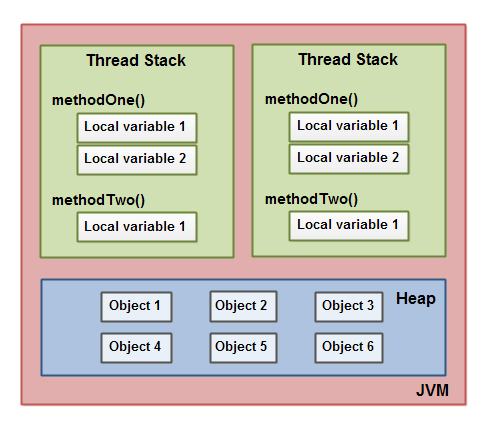

# Multithreading
- extends thread class or implement runnable interface
- if you are implementing runnable then you have to create new object of thread and pass that class in constructor then start thread using t1.start();
- if you are directly extending thread class then use obj.start() method
- methods
  - setDemons :- ignore it

## two ways to create thread

### 1
```java
   class MyThread extends Thread {

    public void run(){
       System.out.println("MyThread running");
    }
  }
  public class Main(String[] args)
  {
    public static void main(String[] args) {
      MyThread myThread = new MyThread();
      myTread.start();
    }
  }
  
```

- You can also create an anonymous subclass of Thread like this:
```java
Thread thread = new Thread(){
    public void run(){
      System.out.println("Thread Running");
    }
  }

  thread.start();
```

### 2

```java
  public class MyRunnable implements Runnable {

    public void run(){
       System.out.println("MyRunnable running");
    }
  }
```

```java
Runnable myRunnable =
    new Runnable(){
        public void run(){
            System.out.println("Runnable running");
        }
    }

```

```java
Runnable runnable =
        () -> { System.out.println("Lambda Runnable running"); };
```

#### Starting a Thread With a Runnable
```java
Runnable runnable = new MyRunnable(); // or an anonymous class, or lambda...

Thread thread = new Thread(runnable);
thread.start();
```


- The Thread.currentThread() method returns a reference to the Thread instance executing currentThread()

### Deamon Thread
- A daemon thread in Java is a thread that does not keep the Java Virtual Machine (JVM) running if the main thread exits the application. A non-daemon thread will keep the JVM running even if the main thread exits the application.

### race condition and critical section
- A race condition is a concurrency problem that may occur inside a critical section. A critical section is a section of code that is executed by multiple threads and where the sequence of execution for the threads makes a difference in the result of the concurrent execution of the critical section.


- if an object is immutable and thereby thread safe, the reference to this object may not be thread safe
- Local variables created by a thread are invisible to all other threads than the thread who created it.

## memory model

- All local variables of primitive types ( boolean, byte, short, char, int, long, float, double) are fully stored on the thread stack and are thus not visible to other threads. One thread may pass a copy of a pritimive variable to another thread, but it cannot share the primitive local variable itself.

- A local variable may be of a primitive type, in which case it is totally kept on the thread stack.

- A local variable may also be a reference to an object. In that case the reference (the local variable) is stored on the thread stack, but the object itself if stored on the heap.

- An object may contain methods and these methods may contain local variables. These local variables are also stored on the thread stack, even if the object the method belongs to is stored on the heap.

- An object's member variables are stored on the heap along with the object itself. That is true both when the member variable is of a primitive type, and if it is a reference to an object.

- Static class variables are also stored on the heap along with the class definition.

- Objects on the heap can be accessed by all threads that have a reference to the object. When a thread has access to an object, it can also get access to that object's member variables. If two threads call a method on the same object at the same time, they will both have access to the object's member variables, but each thread will have its own copy of the local variables.

## Java volatile Write Visibility Guarantee
```java
this.nonVolatileVarA = 34;
this.nonVolatileVarB = new String("Text");
this.volatileVarC    = 300;
```
- When the third instruction in the example above writes to the volatile variable volatileVarC, the values of the two non-volatile variables will also be synchronized to main memory - because these variables are visible to the thread when writing to the volatile variable.
- Accessing volatile variables also prevent instruction reordering which is a normal performance enhancement technique.


## Java synchronized Keyword
- The synchronized keyword can be used to mark four different types of blocks:
  - Instance methods
  - Static methods
  - Code blocks inside instance methods
  - Code blocks inside static methods

- Static method
```java
public static MyStaticCounter{

  private static int count = 0;

  public static synchronized void add(int value){
    count += value;
  }

  public static synchronized void subtract(int value){
    count -= value;
  }
}
```
- Only one thread can execute inside any of the two add() and subtract() methods at any given time. If Thread A is executing add() then Thread B cannot execute neither add() nor subtract() until Thread A has exited add().
- If the static synchronized methods are located in different classes, then one thread can execute inside the static synchronized methods of each class. One thread per class regardless of which static synchronized method it calls.


## Synchronized Block Limitations and Alternatives
- For instance, a synchronized block in Java only allows a single thread to enter at a time. However, what if two threads just wanted to read a shared value, and not update it? That might be safe to allow. As alternative to a synchronized block you could guard the code with a **Read / Write Lock** which as more advanced locking semantics than a synchronized block. Java actually comes with a built in **ReadWriteLock** class you can use.

## when volatile keyword is enough?
- In case only one thread reads and writes the value of a volatile variable and other threads only read the variable, then the reading threads are guaranteed to see the latest value written to the volatile variable. Without making the variable volatile.


Doubt
- Notice how the Java synchronized block construct takes an object in parentheses. In the example "this" is used, which is the instance the add method is called on. The object taken in the parentheses by the synchronized construct is called a monitor object. The code is said to be synchronized on the monitor object. A synchronized instance method uses the object it belongs to as monitor object.
- cache coherence


